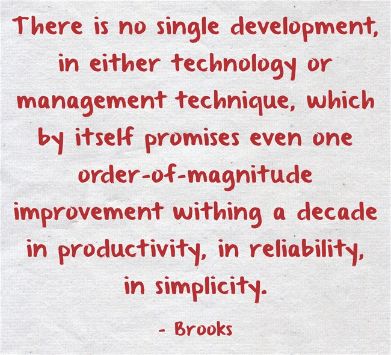

- title : No Silver Bullet
- description : A 'Papers We Love' talk on Fred Brooks' 'No Silver Bullet' paper
- author : Bill Berry
- theme : night
- transition : default

***

### No Silver Bullet
#### ~ Dr. Fred Brooks ~ 
#####(1985)
' these are speaker notes

***

***

[comment]: # (maybe include furry image here)

***
### And So it begins ...
> There is no single development, in either technology or management technique, which by itself promises even one order-of-magnitude improvement withing a decade in productivity, in reliability, in simplicity.

' how could this start so wrong?
' do these words mean anything to you?

---

---

' nope still meanignless

***
#### The Software Management Process

- **Productivity**
- **Reliability** 
- **Simplicity**

***

- Buy don't Build (buy might be OSS)
- Prototype
- Iterative Development
- Employee Retention

***

#### Price to Performance gains 

***

Essecnce & Accedents 

***

What's Really Hard?

- Specification
- Design
- Testing

' this is of the conceptual not the artifacts

---
 
### Sub Slide

---

### Sub Slide

